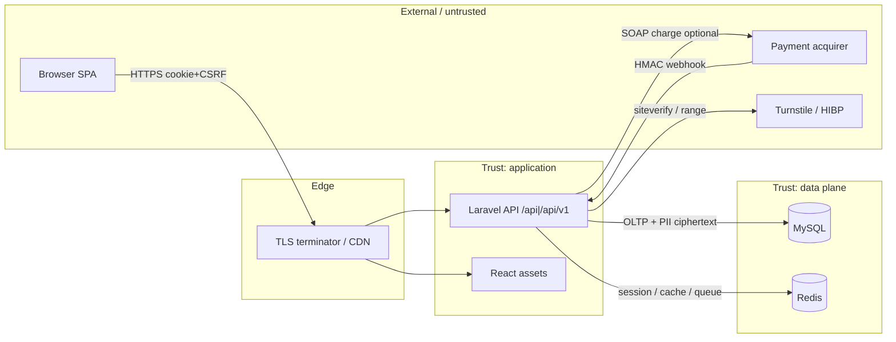

# Threat model (STRIDE) — PDV

> **Status:** Accepted (engineering desk model)  
> **Date:** 2026-07-20  
> **Method:** Lightweight STRIDE on trust boundaries + data-flow diagram (DFD). Complements [`asvs-l2-gap-review.md`](./asvs-l2-gap-review.md); does **not** replace external pen-test.  
> **Scope:** Modular monolith — React SPA + Laravel API + MySQL + Redis; multi-store POS (operational + admin).

Revision: re-run when adding public uploads, live payment WSDL, mobile apps, or new outbound HTTP clients.

---

## 1. Assets (what we protect)

| Asset | Sensitivity | Notes |
|-------|-------------|--------|
| Staff credentials + sessions | High | Sanctum cookie; manager MFA |
| Customer PII (CPF, contact, address, DOB) | High (LGPD) | Encrypted at rest (ADR-0008) |
| Sale / payment / refund integrity | High | Money in cents; idempotency RN-073 |
| Inventory / pricing / promotions | Medium–High | Fraud / loss |
| Audit logs | High | Append-only accountability RN-070 |
| Encryption keys (`APP_KEY`, `CUSTOMER_PII_*`, webhook secret) | Critical | Outside DB dumps |
| Availability of POS | Medium–High | Store operations |

---

## 2. Actors

| Actor | Trust | Capabilities |
|-------|-------|----------------|
| Anonymous internet | Untrusted | Hit login, public webhook URL (if exposed), static SPA |
| Operator | Authenticated, least privilege | POS in assigned store + open shift |
| Manager | Authenticated + MFA | Admin + operational; store-scoped |
| Payment acquirer | Semi-trusted | Signed webhooks; SOAP charge (stub/501 until WSDL) |
| Cloudflare Turnstile / HIBP | Semi-trusted | CAPTCHA / breach check; outage → fail closed or off by config |
| Hosting / DB / Redis ops | Privileged | Infra compromise = full impact |
| Malicious insider (staff) | Partially trusted | Mitigated by RBAC, MFA, audit — not eliminated |

---

## 3. Data-flow diagram (context)

**Trust boundaries (thick):**

1. Browser ↔ Edge/API (TLS, CSRF, authn)  
2. API ↔ Acquirer (HMAC; no PAN persistence)  
3. API ↔ MySQL/Redis (network isolation; app credentials)  
4. Operator vs Manager vs store scope (authz inside API)

---

## 4. STRIDE by boundary

Legend: **S**poofing · **T**ampering · **R**epudiation · **I**nfo disclosure · **D**enial of service · **E**levation of privilege.

### 4.1 Browser ↔ API (SPA cookie session)

| Threat | Example | Mitigation | Residual |
|--------|---------|------------|----------|
| S | Stolen session cookie | HttpOnly, Secure (prod), SameSite, regenerate on login/MFA, logout invalidates | XSS → cookie theft if CSP bypassed |
| S | Credential stuffing | Throttle + Turnstile after N fails; HIBP on create/update; manager MFA | Operators without MFA |
| T | CSRF mutate sale/refund | Sanctum stateful + XSRF; SameSite | Misconfigured `SANCTUM_STATEFUL_DOMAINS` |
| T | Cart / complete race | Domain rules + open shift; Idempotency-Key | Client bugs outside key |
| R | Deny sensitive action | Audit RN-070 (price, stock, refund, promo, reopen, MFA reset) | Actions not in RN-070 |
| I | PII in UI/network | Mask CPF ops; admin only full PII; HTTPS | Manager workstation compromise |
| D | Login / refund flood | `throttle:login`, `throttle:refunds`, MFA throttle | Not every route budgeted |
| E | Operator → admin | `role:manager` + MFA gate | Broken IDOR → E (see 4.3) |

### 4.2 API ↔ payment acquirer

| Threat | Example | Mitigation | Residual |
|--------|---------|------------|----------|
| S | Fake webhook | HMAC secret; reject missing/invalid | Weak secret / clock skew edge |
| T | Replay webhook | Idempotent `payment_webhook_events` | Provider bugs |
| I | PAN at rest | Never persist PAN (ADR-0009) | Memory scrape on POS host |
| D | Webhook storm | Throttle webhooks; queue retry | Shared IP abuse |
| E | Confirm payment without sale authz | Webhook only transitions payment lines by provider payload + HMAC | Logic bugs in reconcile |

### 4.3 Authz / multi-store (IDOR)

| Threat | Example | Mitigation | Residual |
|--------|---------|------------|----------|
| E | Cross-store sale/refund/inventory | `StorePolicy`, `AssertManagerStoreAccess`, `store.context` | New endpoints forgetting assert |
| E | Self MFA reset / lockout abuse | RN-074: other managers only; reason + audit | Colluding managers |
| T | Mass-assign role | FormRequest + Action whitelist | Future fields |

### 4.4 API ↔ MySQL / Redis

| Threat | Example | Mitigation | Residual |
|--------|---------|------------|----------|
| T / I | SQLi → dump | Eloquent bindings only | Raw SQL regressions |
| I | Backup leak of PII | Ciphertext + keys **outside** dump | Key + dump together |
| I | Redis session steal | Private network; password (Docker) | Mis-published ports |
| D | Lock / queue flood | Timeouts; Horizon/Redis sizing | Under-provisioned ops |

### 4.5 Outbound HTTP (Turnstile, HIBP, future SOAP)

| Threat | Example | Mitigation | Residual |
|--------|---------|------------|----------|
| I / SSRF | User-controlled URL fetch | None in MVP user input; fixed vendor URLs | Live SOAP/WSDL must allowlist (ASVS Partial) |
| D | Vendor down | Turnstile/HIBP configurable off; fail closed when enabled and verify fails | Login friction if misconfigured |

### 4.6 Host / supply chain

| Threat | Example | Mitigation | Residual |
|--------|---------|------------|----------|
| T | Compromised dependency | Lockfiles; `composer audit` / `npm audit` | Zero-day |
| E | `APP_DEBUG=true` in prod | Boot guard fail-closed | Local/staging drift |
| I | Telescope/Pulse exposed | Disabled in prod templates | Accidental enable |

---

## 5. Risk register (top residuals)

| ID | Risk | Severity | Status | Next action |
|----|------|----------|--------|-------------|
| TM-01 | No live TLS on local/demo | Med | Accepted local; **prod required** | Operator: `production-hardening.md` |
| TM-02 | External pen-test not executed | High (gate) | Open | [`external-pen-test.md`](./external-pen-test.md) |
| TM-03 | Legal counsel not signed | High (gate) | Open | [`../legal/counsel-sign-off.md`](../legal/counsel-sign-off.md) |
| TM-04 | Card issuer verify 501 | Med | Blocked on WSDL | ADR-0009 |
| TM-05 | Key rotation not runbooked | Med | Open | Next slice: key rotation runbook |
| TM-06 | Idle session UX weak | Low–Med | Open | Idle warning / re-auth slice |
| TM-07 | Customer purge job missing | Med (LGPD ops) | Open | Retention job slice |
| TM-08 | Universal API rate limit incomplete | Low–Med | Accepted MVP | Expand throttles if abused |

---

## 6. Abuse cases (priority for tests / pen-test)

1. Login without CAPTCHA after threshold; CAPTCHA token replay.  
2. Complete sale twice (with/without Idempotency-Key).  
3. Refund other store’s sale; operator hits admin refund.  
4. Webhook with bad HMAC; webhook on `/api` vs `/api/v1`.  
5. MFA skip / recovery reuse / self MFA reset.  
6. Session after logout / inactive user still in `sessionStorage`.  
7. Manager reads customer PII for unassigned store.

Mapped Feature suites: `tests/Feature/Security/*`, Auth MFA, Audit, Refunds, Payments webhook.

---

## 7. Sign-off

| Role | Outcome |
|------|---------|
| Engineering | This STRIDE/DFD accepted as ASVS V1 threat-model artifact for MVP |
| Security review (external) | Still via pen-test execution |
| Product owner | Accept residuals TM-01…TM-08 or schedule slices 2–4 |

---

## 8. History

| Date | Change |
|------|--------|
| 2026-07-20 | Initial STRIDE + DFD after ASVS L2 desk review residuals |
